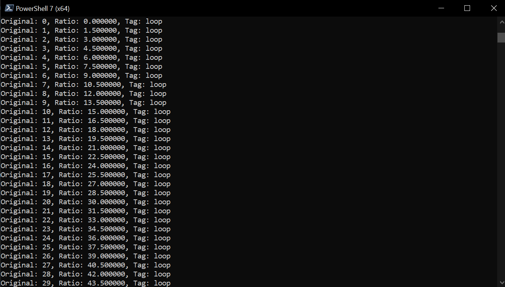
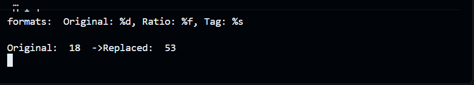
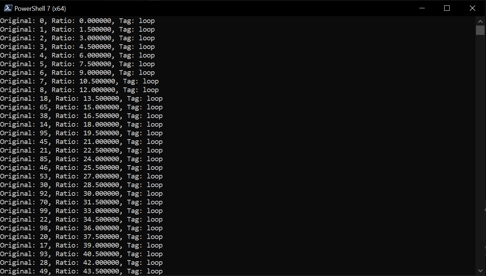

# Random Counter Injection

## Overview
This project demonstrates low‑level interaction with the Windows Universal C Runtime (`ucrtbase.dll`) using Python and CFFI. It manually constructs `va_list` buffers with packed integers, doubles, and pointers, then calls `__stdio_common_vfprintf` to print formatted output. A companion Frida script intercepts these calls at runtime, allowing arguments to be inspected and modified dynamically.

## Features
- **Python + CFFI integration**: Call internal CRT functions directly from Python.
- **Custom `va_list` packing**: Use `struct` to align integers, doubles, and pointers correctly.
- **Loop demonstration**: Continuously prints a counter, ratio, and tag string using `vfprintf`.
- **Frida instrumentation**: Attach to the running process and intercept `__stdio_common_vfprintf` calls.
- **Runtime modification**: Replace arguments (e.g., inject random numbers) before they are printed.

## Project Structure
- `printf_loop.py` → Python script that builds and passes custom `va_list` buffers to `vfprintf`.
- `random_counter_injector.py` → Frida script that hooks into the process and modifies arguments.
- `images/` → Screenshots showing the workflow.
- `.gitignore`, `LICENSE`, `README.md`

## Screenshots

### Before Injection
Shows how the `printf_loop.py` script outputs values before any runtime interception:


### Injection Script in VS Code
Demonstrates the Python/Frida injection code being prepared inside VS Code:


### Injected Output in PowerShell
Displays how the code is intercepted and modified when running in PowerShell:


## Requirements
- Windows 10 or later
- Python 3.9+ with CFFI installed
- Frida (for runtime hooking)

## Installation
```bash
git clone https://github.com/Lletsi/random-counter-injection.git
cd random-counter-injection
pip install cffi frida
